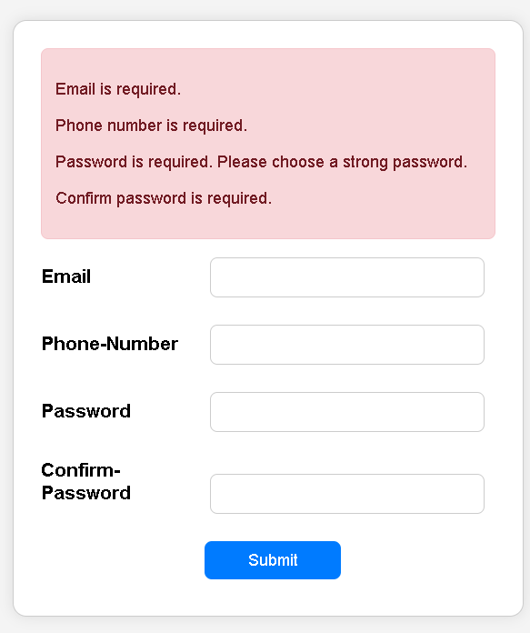
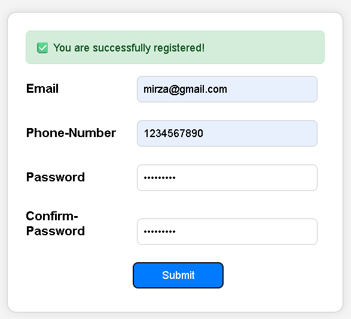

# ✅ User Registration Form with Validation

This project is a simple user registration form that includes front-end validation using **HTML**, **CSS**, and **jQuery**. It provides clear feedback to users with visually distinct **error** and **success** messages.

---

## ✨ Features

- Real-time client-side validation
- Error messages shown in a **red box** if any fields are incorrect or missing
- Success message shown in a **green box** once the form is correctly filled
- Smooth fade-in UI using jQuery

---

## 🛠️ Technologies Used

- HTML5
- CSS3
- jQuery (JavaScript library)

---

## 📸 Screenshots

### ❌ Error Message Box (Red)
If any required field is left blank or contains invalid input, error messages are shown like this:

![Error Message Example]

### ✅ Success Message Box (Green)
When all fields are valid, a green box appears confirming the registration:

![Success Message Example]

## 📄 Validation Rules

1. **Email**:
   - Required
   - Must be in a valid format (e.g., `example@domain.com`)

2. **Phone Number**:
   - Required
   - Must be exactly 10 digits

3. **Password**:
   - Required
   - Minimum 8 characters
   - Must contain at least one uppercase letter, one lowercase letter, one number, and one special character

4. **Confirm Password**:
   - Required
   - Must match the password field

---

## 🚀 How It Works

- On clicking the **Submit** button:
  - If any fields are invalid or empty, an error message is displayed inside a red box.
  - If all fields are valid, a success message is shown in a green box.

